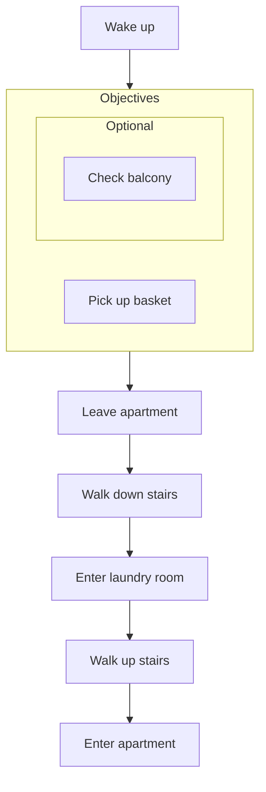
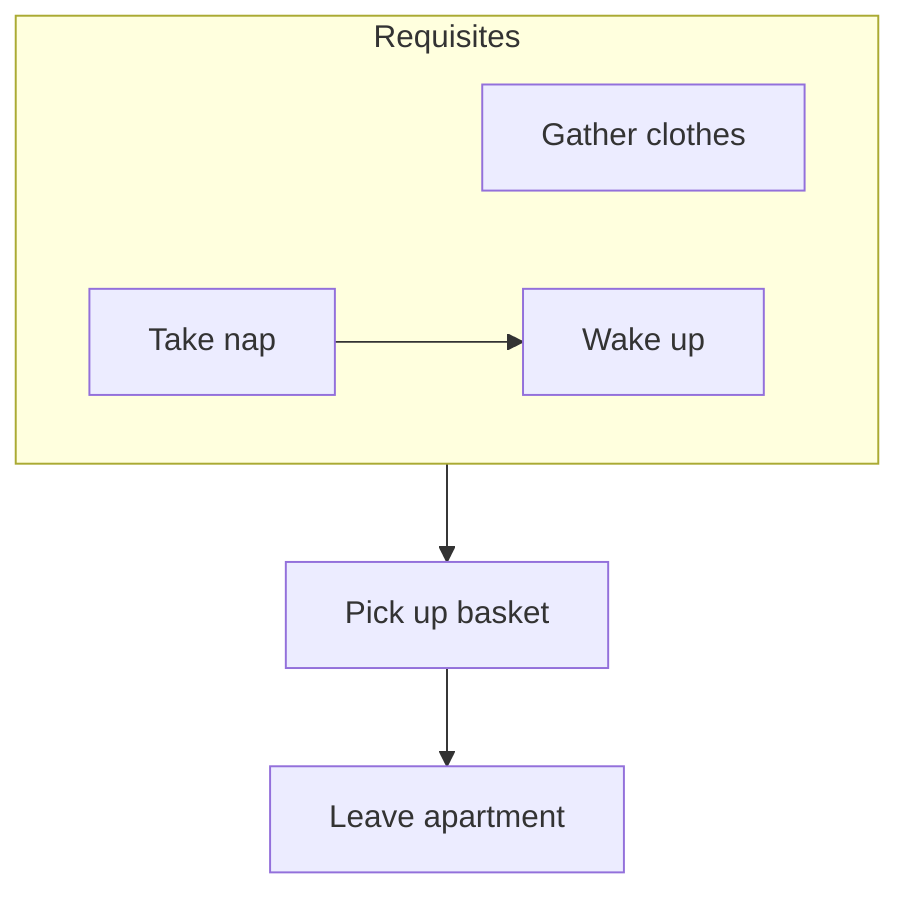

# Vardag: Midnight Laundry

_You awake on your couch to your alarm clock ringing, the TV light slowly washing away your torpor._

_It's midnight and you remember you've booked the late night laundry slot._

## Description

_Vardag: Midnight Laundry_ is a short horror game. It is the first episode of the Vardag horror series, an episodic game anthology featuring everyday scenarios with horror twists.

The game is designed to be finished in a single short sitting (max 1 hour).

## Built with

This game is built using the Godot engine, utilizing free assets and some custom made.

- Godot 4.4
- Blender 3.4
- Audacity
- GIMP

## License

_Vardag_ is dual-licensed under the MIT license and the Apache 2.0 license.

## Acknowledgements

This game has been developed and designed using various resources listed below.

- ambientCG - Public Domain Resources for Physically Based Rendering (https://ambientcg.com)

    
<h2>Design (SPOILERS AHEAD)</h2>

🛑 DO NOT READ FURTHER IF YOU PLAN TO PLAY VARDAG 🛑

### Act 1 (Introduction)

The first 

### Act 2 (Crescendo)

### Act 3 (Finale)

